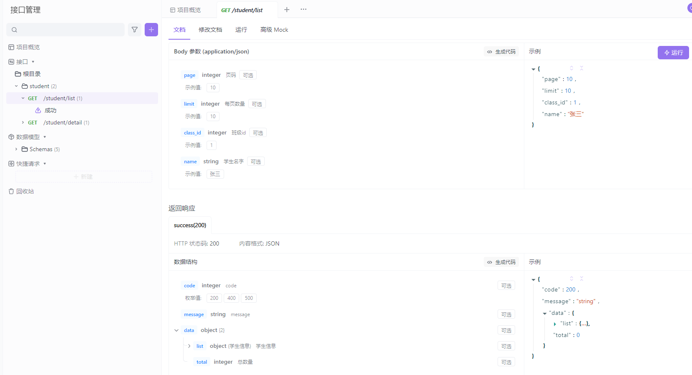

一个laravel使用swagger的案例
php artisan migrate
php artisan db:seed
php artisan l5-swagger:generate
php artisan serve
doc-web: http://127.0.0.1:8000/api/documentation
doc-json: http://127.0.0.1:8000/docs/api-docs.json ,可以用apifox导入
接口示例: http://127.0.0.1:8000/student/list?page=1&limit=1&name=bob

